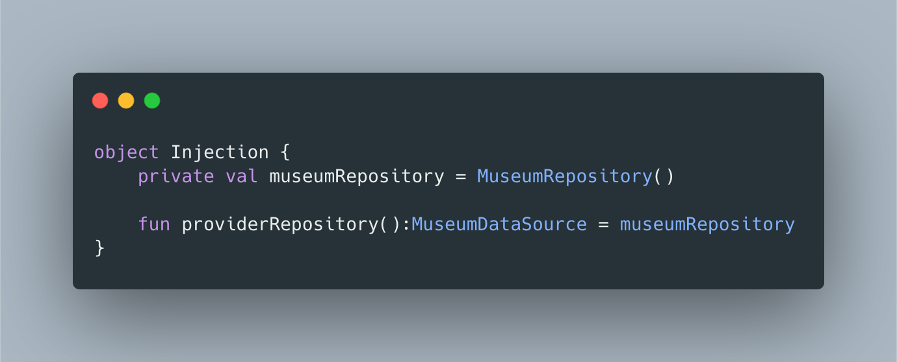
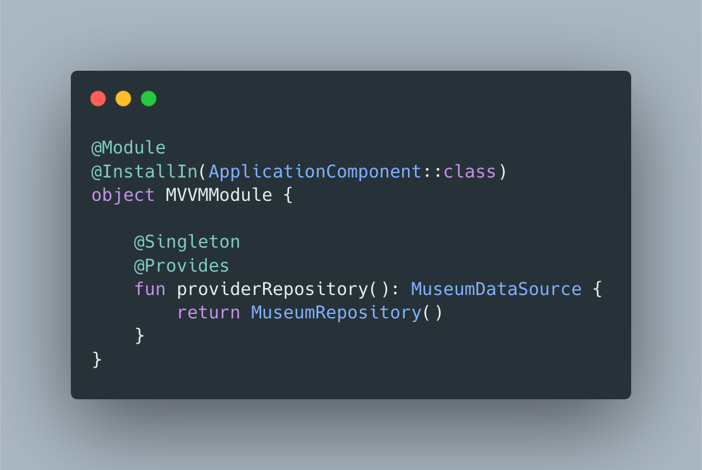
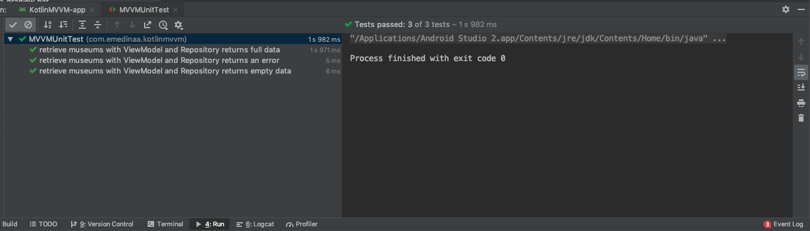
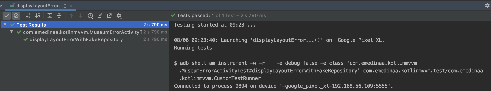
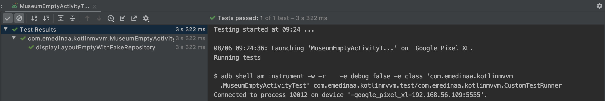
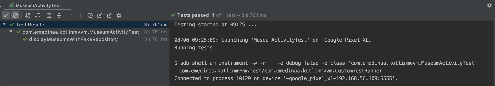

# kotlin-mvvm

Languages: [English](Readme.md), [Spanish](Readme.es.md)

  

MVVM(Model View ViewModel) ejemplo en Kotlin usando los componentes : ViewModel, LiveData, Coroutines y Hilt(DI), las bibliotecas Retrofit, Gson, Glide y Okhttp. Además, integración de Hilt para Android tests.

Inyección de dependencias manual

Inyección de dependencias con Hilt

### Testings
 

 
 
 

### Slides

Android MVVM https://docs.google.com/presentation/d/1nTwtU8OWYs_8Q3i_3hOPAWodDpDKzO--uA-4b6LUr8g/edit?usp=sharing

### Updates [August 2020]

- Se agregó inyección de dependencias con Hilt dependency, incluye android tests. [branch hilt](https://github.com/emedinaa/kotlin-mvvm/tree/hilt)

- Se agregó tests unitarios con Flow [branch flow](https://github.com/emedinaa/kotlin-mvvm/tree/flow)

- Se agregó Kotlin Flow y la dependencias Fragment Ktx [branch flow](https://github.com/emedinaa/kotlin-mvvm/tree/flow)

- Se agregó un ejemplo con Room [branch room](https://github.com/emedinaa/kotlin-mvvm/tree/room)

- Se agregó View Binding [branch viewbinding](https://github.com/emedinaa/kotlin-mvvm/tree/viewbinding)

- Se actualizó las versiones de las dependencias del proyecto y se removio la clase ViewModelProviders(deprecated). [all branches](https://github.com/emedinaa/kotlin-mvvm/)

- Se agregó coroutines con Retrofit y sealed classes(clases selladas) para reemplazar los callbacks. Incluye tests unitarios con coroutines. [branch coroutines](https://github.com/emedinaa/kotlin-mvvm/tree/coroutines)

- Se agregó Koin, framework de inyección de dependencias escrito en Kotlin, Incluye también integración con Mockito para los tests unitarios.(11th Oct) [branch koin](https://github.com/emedinaa/kotlin-mvvm/tree/koin)

- Se agregó tests unitarios con Mockito (27th May) [Link](https://github.com/emedinaa/kotlin-mvvm/commit/92d9e5a659c21178364d0b51e904fd126b0b6204)

- Se resolvió la carga de images en Android 9.0(Pie) por Carlos Ugaz [carlosgub](https://github.com/carlosgub) [Link](https://github.com/emedinaa/kotlin-mvvm/pull/1)

### Dependencies

- Coroutines 1 [version: '1.3.0'](https://kotlinlang.org/docs/reference/coroutines-overview.html)
- Coroutines Test 1 [version '1.3.0'](https://github.com/Kotlin/kotlinx.coroutines/tree/master/kotlinx-coroutines-test)
- LifeCycleKtx 2 [version: '2.2.0'](https://developer.android.com/kotlin/ktx)
- ViewModelKtx 2 [version: '2.2.0'](https://developer.android.com/kotlin/ktx)
- Retrofit 2 [version: '2.6.0'](https://square.github.io/retrofit/) ~~Retrofit '2.3.0'~~
- OkHttp 4 [version: '4.0.1'](https://square.github.io/okhttp/) ~~OkHttp 3.4.1~~
- Gson [version:'2.6.0'](https://github.com/google/gson)
- Glide [version: '4.9.0'](https://github.com/bumptech/glide)
- AndroidX [version: '1.2.0'](https://mvnrepository.com/artifact/androidx)
- Arch Lifecycle [version: '2.2.0'](https://developer.android.com/jetpack/androidx/releases/lifecycle)
- Mockito [version: '2.27.0'](https://site.mockito.org/)
- Arch Testing [version: '2.1.0'](https://mvnrepository.com/artifact/android.arch.core/core-testing?repo=google)

### References

- Dependency Injection on Android with Hilt https://medium.com/androiddevelopers/dependency-injection-on-android-with-hilt-67b6031e62d
- Dependency injection with Hilt https://developer.android.com/training/dependency-injection/hilt-android
- Testing coroutines on Android (Android Dev Summit 19') https://www.youtube.com/watch?v=KMb0Fs8rCRs&vl=en
- Coroutines with Architecture components https://developer.android.com/topic/libraries/architecture/coroutines?hl=en
- Sealed Classes Instead of Exceptions in Kotlin https://phauer.com/2019/sealed-classes-exceptions-kotlin/
- ViewModel https://developer.android.com/topic/libraries/architecture/viewmodel
- LiveData https://developer.android.com/topic/libraries/architecture/livedata
- Android Architecture Blueprints https://github.com/googlesamples/android-architecture
- Android Jetpack: ViewModel https://www.youtube.com/watch?v=5qlIPTDE274
- Mockito : https://site.mockito.org/
- Unit Testing + Mockito + Kotlin + Architecture components https://medium.com/@marco_cattaneo/unit-testing-with-mockito-on-kotlin-android-project-with-architecture-components-2059eb637912
- Junit + LiveData https://jeroenmols.com/blog/2019/01/17/livedatajunit5/

### Contributing and reporting issues

Si deseas contribuir en este repositorio, por favor enviar un Pull Request o si quieres reportar algún error por favor enviar a https://github.com/emedinaa/kotlin-mvvm/issues

Cualquier duda o consulta es bienvenida. También, si consideras que este repositorio útil, puedes darle una estrella ⭐ ⭐ ⭐.
