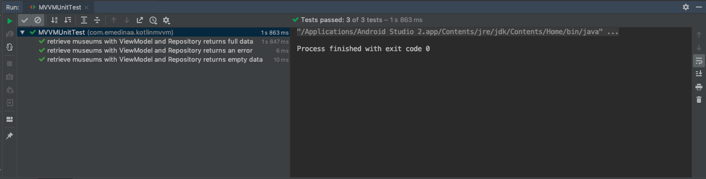

# kotlin-mvvm

      

MVVM(Model View ViewModel) sample in Kotlin using the components ViewModel, LiveData, the libraries Retrofit, Glide and Mockito for testing.

## Dependencies

- Coroutines 1 [version: '1.3.0'](https://kotlinlang.org/docs/reference/coroutines-overview.html)
- Coroutines Test 1 [version '1.3.0'](https://github.com/Kotlin/kotlinx.coroutines/tree/master/kotlinx-coroutines-test)
- LifeCycleKtx 2 [version: '2.2.0'](https://developer.android.com/kotlin/ktx)
- ViewModelKtx 2 [version: '2.2.0'](https://developer.android.com/kotlin/ktx)
- Retrofit 2 [version: '2.6.0'](https://square.github.io/retrofit/) ~~Retrofit '2.3.0'~~
- OkHttp 4 [version: '4.0.1'](https://square.github.io/okhttp/) ~~OkHttp 3.4.1~~
- Gson [version:'2.6.0'](https://github.com/google/gson)
- Glide [version: '4.9.0'](https://github.com/bumptech/glide)
- AndroidX [version: '1.0.0'](https://mvnrepository.com/artifact/androidx)
- Arch Lifecycle [version: '2.0.0'](https://developer.android.com/jetpack/androidx/releases/lifecycle)
- Mockito [version: '2.27.0'](https://site.mockito.org/)
- Arch Testing [version: '1.1.1'](https://mvnrepository.com/artifact/android.arch.core/core-testing?repo=google)

## References

- Testing coroutines on Android (Android Dev Summit 19') https://www.youtube.com/watch?v=KMb0Fs8rCRs&vl=en
- Coroutines with Architecture components https://developer.android.com/topic/libraries/architecture/coroutines?hl=en
- Sealed Classes Instead of Exceptions in Kotlin https://phauer.com/2019/sealed-classes-exceptions-kotlin/
- ViewModel https://developer.android.com/topic/libraries/architecture/viewmodel
- LiveData https://developer.android.com/topic/libraries/architecture/livedata
- Android Architecture Blueprints https://github.com/googlesamples/android-architecture
- Android Jetpack: ViewModel https://www.youtube.com/watch?v=5qlIPTDE274
- Mockito : https://site.mockito.org/
- Unit Testing + Mockito + Kotlin + Architecture components https://medium.com/@marco_cattaneo/unit-testing-with-mockito-on-kotlin-android-project-with-architecture-components-2059eb637912
- Junit + LiveData https://jeroenmols.com/blog/2019/01/17/livedatajunit5/

I appreciate any question or comment. Also, if you consider it useful , you can give me a star. Besides, you can put any issue at https://github.com/emedinaa/kotlin-mvvm/issues
