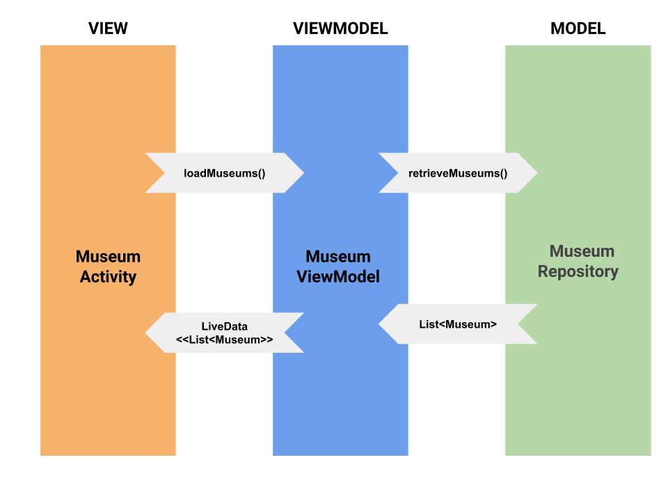
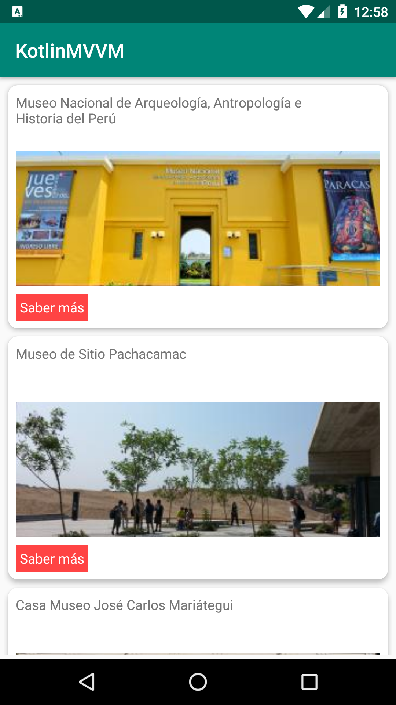
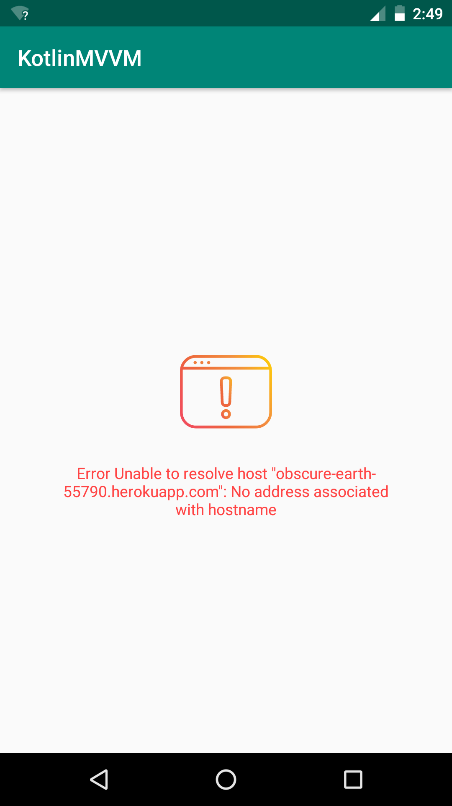

# kotlin-mvvm

  

MVVM(Model View ViewModel) sample in Kotlin using the components ViewModel, LiveData and Retrofit library

## MVVM Pattern (Model View ViewModel)
 

## Architecture

## Flow

 
## Demo

 

## Screenshots

  

## Updates

- Updates and improvements about this repository. [Link](https://github.com/emedinaa/kotlin-mvvm/blob/master/UPDATES.md)

## Dependencies

- Retrofit https://square.github.io/retrofit/
- OkHttp https://square.github.io/okhttp/
- Glide https://github.com/bumptech/glide

## References

- ViewModel https://developer.android.com/topic/libraries/architecture/viewmodel
- LiveData https://developer.android.com/topic/libraries/architecture/livedata
- Android Architecture Blueprints https://github.com/googlesamples/android-architecture
- Android Jetpack: ViewModel https://www.youtube.com/watch?v=5qlIPTDE274

I appreciate any question or comment. Also, if you consider it useful , you can give me a star. Besides, you can put any issue at https://github.com/emedinaa/kotlin-mvvm/issues
